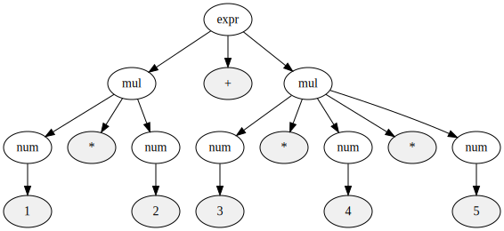

# 以生成規則描述運算子的優先順序

生成規則用來描述文法是非常強大的工具。只要稍微花點功夫，也可以在生成規則裡表現運算子的優先順序。如下面的文法所示：

```text
expr = mul ("+" mul | "-" mul)*
mul  = num ("*" num | "/" num)*
```

之前的規則是直接用`expr`來展開`num`，這次我們透過`mul`這條規則來展開`num`。`mul`是描述乘除法的生成規則，執行加減法的`expr`則是把`mul`當成一個零件用來建構其規則。這個文法會自然地把乘除法優先結合，並表示在語法樹上面。我們來看看具體的例子：




上述的樹結構中，乘法比起加法更靠近樹的末端。實際上，因為並沒有從mul接回expr的規則，所以不會產生在乘法下面進行加法的樹，像這樣用很簡單的規則就可以用樹的結構來描述運算子的優先順序，讓人感到非常地不可思議。讀者們也實際對照一下生成規則和語法樹，確認語法樹的正確性吧。

